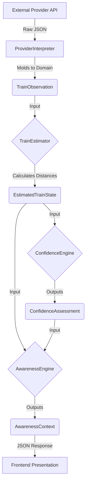
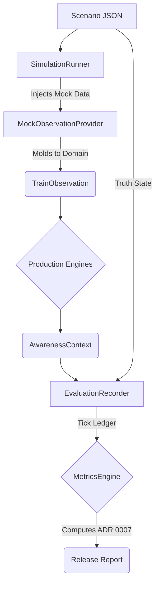

# RailAware Architecture Guide

## 1. Architecture Summary

### Project Purpose
RailAware is an awareness platform designed to evaluate and communicate real-time railway safety states to users near active rail infrastructure. Its primary directive is to provide highly confident safety indicators without ever collapsing uncertainty into a false sense of safety.

### Architectural Philosophy
The core philosophy is **objective reality vs. subjective awareness**.
- The system strictly isolates the acquisition of external provider telemetry (objective reality) from the calculation of user safety (subjective awareness).
- Uncertainty is treated as a first-class citizen. "We don't know" and "There is no train" are structurally impossible to conflate.

### Production Pipeline
The pipeline is strictly unidirectional (ADR 0001). Data flows in a single direction without cycles:
1. **Acquisition:** Providers fetch external data.
2. **Standardisation:** Data is normalized into `TrainObservation`.
3. **Estimation:** The `TrainEstimator` synthesizes physical observations with known topology to measure absolute along-track distances.
4. **Evaluation:**
   - `ConfidenceEngine` quantifies data reliability.
   - `AwarenessEngine` determines subjective user safety (e.g., `APPROACHING_STATION`).
5. **Presentation:** The frontend renders solely based on `AwarenessContext.requiresProminentDisplay`.

### Dependency Rules & Invariants
- **Provider Independence (ADR 0002):** No internal engine may depend on provider-specific fields, keys, or anomalies.
- **Evaluation Isolation (ADR 0007):** The production pipeline must never depend on or be aware of the evaluation framework. Evaluation must never mutate production state.
- **Estimation Ownership (ADR 0006):** All distance mathematics reside exclusively in `TrainEstimator`.

### Confidence Model (ADR 0003)
Confidence is divided into three completely orthogonal pillars:
- `ProviderReliability`: How trustworthy is the data source?
- `TopologyConfidence`: How accurately did we map the physical track?
- `ObservationConfidence`: How recent and complete is the telemetry?
**Invariant:** These three pillars are never mathematically combined into a "composite score".

---

## 2. Runtime Data Flow

### Production Data Flow

1. **Provider:** Fetches raw data from the third-party API.
2. **TrainObservation:** The standard domain object reflecting objective reality.
3. **TrainEstimator:** Uses corridor topology to project the train's `segmentProgress` into absolute meters.
4. **EstimatedTrainState:** The output containing pure physical distances (e.g., `distanceMetres: 4500`).
5. **ConfidenceEngine:** Evaluates the `TrainObservation` to assess data staleness and completeness.
6. **AwarenessEngine:** Consumes both physical distances and confidence levels to determine semantic safety states (e.g., `AT_STATION`, `UNKNOWN`).
7. **AwarenessContext:** The final payload containing `requiresProminentDisplay: true/false`.
8. **Presentation:** The UI blindly respects the context and triggers the overlay.

### Evaluation Framework Flow

The Evaluation Framework exercises exactly the same pipeline but isolates it.

Instead of hitting external APIs, the `SimulationRunner` drives time forward deterministically, injecting static scenario payloads into the production engines. The `EvaluationRecorder` logs the system's subjective output (`AwarenessContext`) alongside the scenario's objective `groundTruth`, allowing the `MetricsEngine` to objectively calculate `PositionError` and false negatives.
