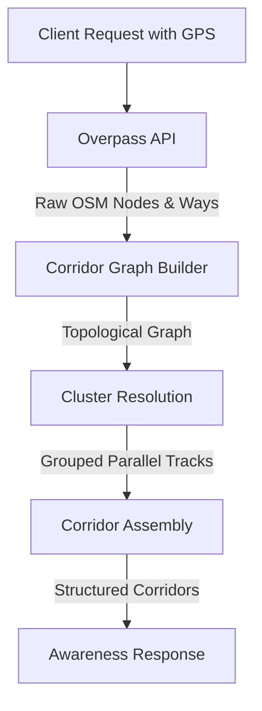

# RailAware Architecture

## Backend Spatial Resolution Pipeline



## API Endpoint Separation

The backend surfaces three distinct endpoints, intentionally separating authoritative spatial facts from probabilistic assumptions.

```mermaid
flowchart TD
    Client -->|Authoritative| A[/api/v1/awareness]
    Client -->|Timetable/Scheduled| B[/api/v1/schedule/corridor/:id]
    Client -->|Research/Probabilistic| C[/api/v1/observation]

    A -.->|Returns| D[Physical Track/Crossing Data]
    B -.->|Returns| E[Static Timetable Schedules]
    C -.->|Returns| F[Confidence-scored train assumptions]
```
- **`/api/v1/awareness`**: The core, verified product. It exclusively answers questions about the physical environment based on known spatial topology.
- **`/api/v1/schedule/corridor/:id`**: Provides published schedule data. It never implies live train positioning.
- **`/api/v1/observation`**: A research-tier endpoint. It attempts to score real-world observations based on provider reliability and topology confidence, but remains explicitly experimental.

## Service Worker & Offline Fallback Decision Tree

The Service Worker explicitly distinguishes between genuine network failures (where cache is appropriate) and application-level or server-level errors (where the user must be informed honestly).

```mermaid
flowchart TD
    A[Client fetch /api/v1/awareness] --> B{Network Fetch Success?}
    
    B -->|Yes (200 OK)| C[Clone Response]
    C --> D[Parse & Save to IndexedDB]
    D --> E[Return Response to App]
    
    B -->|Yes (500 Error, 429 Rate Limit)| F[Return Error Response to App]
    F --> G[App Renders Network Error Overlay]
    
    B -->|No (Throws Network Error / Offline)| H{Check IndexedDB Cache}
    H -->|Data Exists| I[Inject _isCached: true]
    I --> J[Return Cached Payload to App]
    J --> K[App Renders Amber Offline Banner]
    
    H -->|No Data| L[Return 503 Offline Error]
    L --> M[App Renders Network Error Overlay]
```
